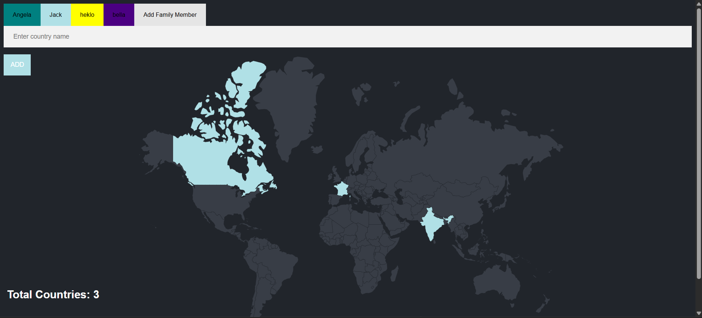
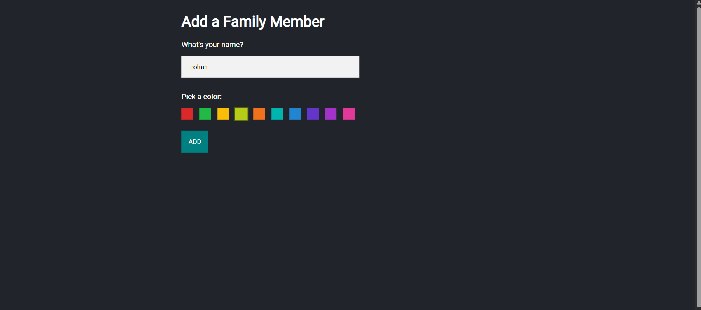

# family-travel-tracker
A web application that can be used to mark/track the countries that different members of a family/community have travelled to. Created using JavaScript, Node.js, Express.js, PostgreSQL, EJS.

For the database:
Follow the instructions and queries stated in the queries.sql.
Execute in PostgreSQL.

Installation:
1. Clone the repository git clone https://github.com/varshita2717/family-travel-tracker/

2.Navigate to the project folder cd family-travel-tracker

3.Install dependencies npm install or npm i

4.Start the server node index.js or with nodemon : nodemon index.js'

Note: The database credentials in this repository are intentionally incorrect for security reasons. 
Please configure your own database credentials before running the project.

Overview of the web application:
Home page:

## Home Page

Adding Members:

